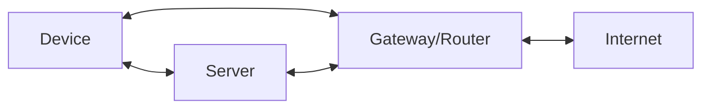

# Networks and Network Security

---
layout: center
---

# Networks

- A **network** is a group of two or more devices that are connected together to share resources and information.
- Most networks include a connection to the internet, which allows devices to communicate with other devices and access online resources.
- Networks communicate using a set of rules called **protocols**. The most common important protocol for us to have some understanding of is the **Transmission Control Protocol/Internet Protocol (TCP/IP)**, which is used to send and receive data over the internet.
  - TCP/IP is technically a suite of protocols, designed to work together to allow devices to communicate over the internet. It is the foundation of the internet and is used by almost all devices that connect to it.

---
layout: center
---

# TCP/IP Basics

- TCP stands for Transmission Control Protocol.
  - TCP breaks down data messages into **packets** - small chunks of data that can be sent across a network. Each packet contains information about the sender, receiver, and how to reassemble the packets into the original message.
- IP stands for Internet Protocol.
  - IP is responsible for **addressing** and **routing** packets of data across networks.
  - Each device on a network has a unique **IP address**.
  - The IP address identifies each device and allows it to send and receive data.

---
layout: center
---

# Packet Metadata

Each packet contains:

- **Source IP address**: The IP address of the device that sent the packet.
- **Destination IP address**: The IP address of the device that is intended to receive the packet.
- **Sequence number**: A number that indicates the order of the packets in the original message.
- **Checksum**: A value that is used to verify the integrity of the packet and ensure that it has not been corrupted during transmission.
- **Protocol**: The protocol used to send the packet, such as TCP or UDP (User Datagram Protocol).
- **Payload**: The actual data being sent in the packet.
- **Port number**: A number that identifies the specific application or service that is sending or receiving the packet.

---
layout: center
---

# Check your understanding

1. What does the IP address do for your device?
2. What is the difference between TCP and IP?
3. What is the purpose of the sequence number in a packet?
4. What is the purpose of the checksum in a packet?

---
layout: center
---

# Network Vulnerabilities

Common network vulnerabilities include:

- **Weak authentication and access controls**: Poorly implemented authentication and access controls can allow unauthorized users to gain access to a network or device.
- **Unpatched software and firmware**: Outdated software and firmware can contain security vulnerabilities that can be exploited by attackers.
- **Misconfigured network devices**: Incorrectly configured network devices, such as routers and firewalls, can create security holes that can be exploited by attackers.

---
layout: center
---

# Network Security Threats

Threats to network security:

- **Malware**: Malicious software that can infect devices and networks, such as viruses, worms, and trojans.
- **Hacking**: Unauthorized access to a network or device, often with the intent to steal data or cause damage.
- **Denial of Service (DoS) attacks**: An attack that floods a network or website with traffic, making it unavailable to users.
- **Man-in-the-middle (MitM) attacks**: An attack where an attacker intercepts and alters communications between two parties, often to steal sensitive information.

---
layout: center
---

# Mitigating Network Security Threats

- **Firewalls**: A firewall is a network security device that monitors and controls incoming and outgoing network traffic based on predetermined security rules. Firewalls can be hardware-based, software-based, or a combination of both.
- **Intrusion Detection and Prevention Systems (IDPS)**: An IDPS is a network security system that monitors network traffic for suspicious activity and can take action to prevent or mitigate attacks. IDPS can be signature-based, anomaly-based, or a combination of both.
- **Virtual Private Networks (VPNs)**: A VPN is a secure connection between two or more devices over the internet.
  - VPNs use encryption to protect data and can be used to securely connect remote workers to a company's network.
- **Network segmentation**: Network segmentation is the practice of dividing a network into smaller, isolated segments to improve security and performance.

---
layout: two-cols-header
---

# Activity

Match the mitigation techniques with the threats they are designed to protect against (there will be more than one match for some on both sides):

::left::

## Threats

- Malware
- Hacking
- Denial of Service (DoS) attacks
- Man-in-the-middle (MitM) attacks

::right::

## Mitigation Techniques

- Firewalls
- Intrusion Detection and Prevention Systems (IDPS)
- Virtual Private Networks (VPNs)
- Network segmentation

---
layout: center
---

# Case Study

Freddy's Fast Food is a popular fast-food chain that has recently experienced a data breach. The breach was caused by a hacker who exploited a vulnerability in the company's network. The hacker was able to gain access to sensitive customer information, including names, addresses, and credit card numbers.

1. What network vulnerabilities may have contributed to the data breach at Freddy's Fast Food?
2. What network security threats may have been involved in the data breach?
3. Identify the most relevant mitigation technique Freddy's Fast Food could implement to prevent future data breaches?
4. How can Freddy's Fast Food educate its employees about network security best practices to reduce the risk of future breaches?
