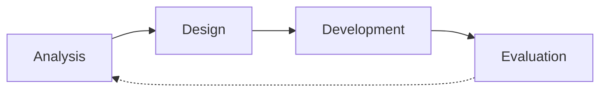

# Emerging Technologies

Our next unit is focused on **Emerging Technologies**. In this unit, you will:

- Learn about emerging technologies and their potential impact on society
- Explore the ethical considerations and challenges associated with emerging technologies
- Identify a potential use of an emerging technology (or technologies) and create a proof of concept for your idea
- Follow the problem solving methodology to analyse a problem, design a solution, develop a proof of concept and evaluate whether your solution is effective and feasible

---
layout: center
zoom: 1.2
---

# What makes a technology "emerging"?

Emerging technologies are:
- New or innovative
- Rapidly evolving
- Have the potential to significantly impact society, the economy, or the environment

---
layout: two-cols-header
zoom: 1.1
---

# Emerging Technologies - Examples

::left::

**AI Agents**

- Use of generative AI to create autonomous agents that can perform tasks and make decisions without human intervention

**Quantum Computing**

- Use of quantum mechanics to perform computations that are exponentially faster than classical computers

**Autonomous Systems**

- Use of AI and robotics to create systems that can operate independently, such as self-driving cars or drones

::right::

**Wearable Technology**

- Use of sensors and other technologies to create devices that can be worn on the body, such as smartwatches or fitness trackers

**Biotechnology**

- Use of biological systems and organisms to create new products or processes, such as gene editing or synthetic biology

---
layout: two-cols-header
zoom: 1.1
---

# Emerging Technologies - Examples

::left::

**Computer Vision and Image Recognition**

- Use of machine learning to enable computers to interpret and understand visual information, such as object detection, facial recognition, or medical imaging

**3D Bioprinting**

- Use of 3D printing technology to create living tissues and organs for medical applications

::right::

**Internet of Things (IoT) and Home Automation**

- Use of connected devices and sensors to collect and exchange data, such as smart home devices or industrial sensors

**Digital Twins**

- Use of digital replicas of physical objects or systems to simulate and analyse their behavior, such as in manufacturing or urban planning
  
---
layout: center
zoom: 1.2
---

# The Problem Solving Methodology

In the Problem Solving Methodology (**PSM**) we:

- **Analyse** a problem to understand its requirements and constraints
- **Design** a solution that meets the requirements and constraints
- **Develop** and test a solution
- **Evaluate** whether the solution is efficient and effective, and whether it meets the requirements and constraints

We will be using a slightly adjusted version of the PSM to allow us to create a proof of concept for an emerging technology idea

---
layout: center
zoom: 1.2
---

# Check for Understanding

Identify the problem solving stage you would expect each of the following activities to occur in:

1. Researching the current state of the art in a particular emerging technology
2. Building a prototype for your technology idea
3. Asking people who have seen your proof of concept for feedback on how it could be improved
4. Drawing a diagram for how your technology idea could work

<v-clicks>

**1. Analysis 2. Development 3. Evaluation 4. Design**

</v-clicks>

---
layout: center
zoom: 1.2
---

# Reliable Research

- The most important factor in the reliability of research is the **source** of the information
- Reliable sources are those that are **credible, accurate, and unbiased**.
- Reliable sources include:
  - Academic journals and conference papers
  - Government publications and reports
  - Reputable news outlets and media organizations
  - Industry reports and white papers from reputable companies
- Unreliable sources include:
  - Personal blogs and social media posts
  - AI generated content
  - Websites with a clear bias or agenda

---
layout: center
zoom: 1.4
---

# Searching for Realiable Sources

- Google Scholar (https://scholar.google.com/) - a search engine for academic papers and articles
- Microsoft Academic (https://academic.microsoft.com/) - a search engine for academic papers and articles
- Google News (https://news.google.com/) - a search engine for news articles from reputable sources

> We are searching for information about emerging technologies, so the **date of the source** is very important. Anything before 2020 is too old to be useful for this unit. Check the date of the source before using it and use search filters to limit your results to recent sources.

---
layout: two-cols
zoom: 1.1
---

# Activity

- You will choose/be allocated an emerging technology to investigate. 
- This will not necessarily be the technology for your proof of concept
- For your allocated technology, you will find:
  - 1 thing everyone should know about it
  - 1 issue that might limit or prevent the use of this technology (in certain situations)
  - 2 examples of how it is already being used
  - 3 advantages this technology has over existing technologies

At the end of the time, you will present your findings (on a single slide) to the class.

::right::

# Emerging Technologies

1. AI Agents
2. Quantum Computing
3. Autonomous Systems
4. Biotechnology
5. Computer Vision/Image Recognition
6. 3D Bioprinting
7. Internet of Things (IoT) and Home Automation
8. Digital Twins
9. *Propose an emerging technology not included*

---
