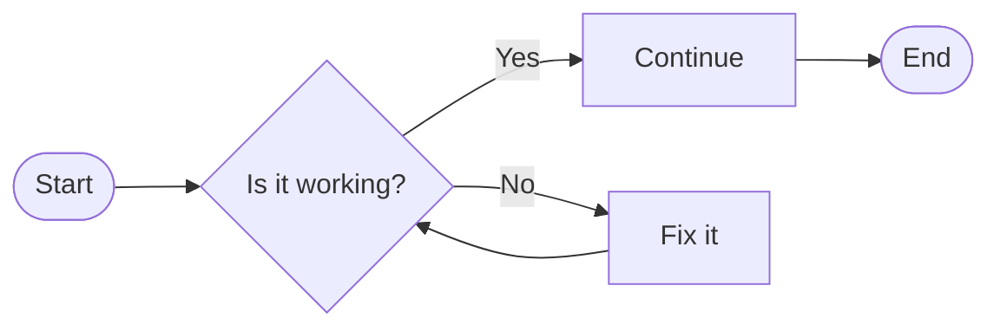

# Designing an Emerging Solution

## Design tools and techniques

---
layout: center
---

# Design

Designing digital solutions focuses on answering two core questions:

- How will the solution work? **Functional design**
- How will the solution look? **Visual design**

The design tools used to convey this information depends on the solution being developed. You will need to choose at least one design tools for each of the two questions.

---
layout: center
---

# Functional Design Tools - Flowcharts

Flowcharts show the flow of information, decision points and sequence of steps in a process. It is a simple and effective way to communicate how a solution will work.



>[!NOTE]
> **Key conventions for flowcharts** - *Rectangles* for processes, *diamonds* for decisions, *rounded rectangles* for start/end points

---
layout: two-cols-header
zoom: 1.1
---

# Functional Design Tools - Use Case Diagrams

::left::

A Use Case Diagram (UCD) is a visual representation of the interactions between users (actors) and a system. It helps to identify the functional requirements of a solution by illustrating how users will interact with it.

They provide a high level overview of the system's functionality, with thought about who will use it.

::right::


```mermaid

usecase-beta
direction LR
actor Customer("Customer")
systemBoundary "Order system"
  Checkout("Place order")
end
Customer --- Checkout

```

>[!NOTE]
> **Key conventions for Use Case Diagrams** - *Actors* are represented by stick figures, *use cases* are represented by ovals, and *relationships* are represented by lines connecting actors to use cases.]